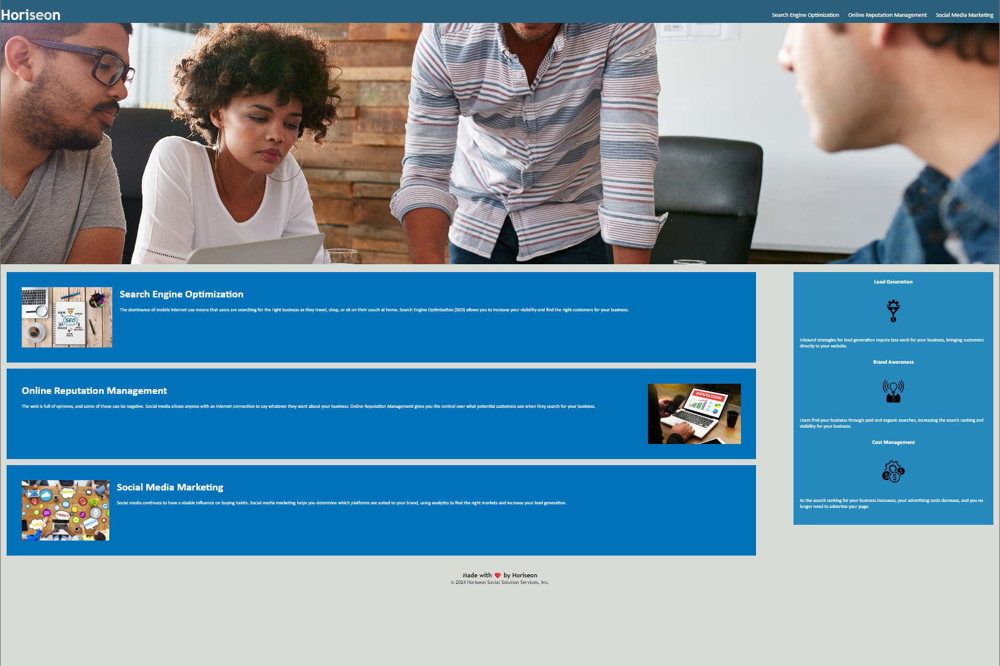

# Horiseon-Refactor-Repo

## Project Description

The customer requested a refactor of existing code in order to meet accessibilty standards and make the site more user friendly and reaches a wider customer base on search engines.

### Detail of Work

    * Adjusting basic code with semantic HTML 
    * Minimizing CSS code to condense the workspace
    * Cleaned up code base to make it easier to read 
    * Using alternate information for broken image sources
    * Checked for functionality issues and broken links
    * Commented on changed code 

[Horiseon](https://smrsun.github.io/horiseon-refactor-repo/)

[Link to Github Repo Page](https://github.com/smrsun/horiseon-refactor-repo)
